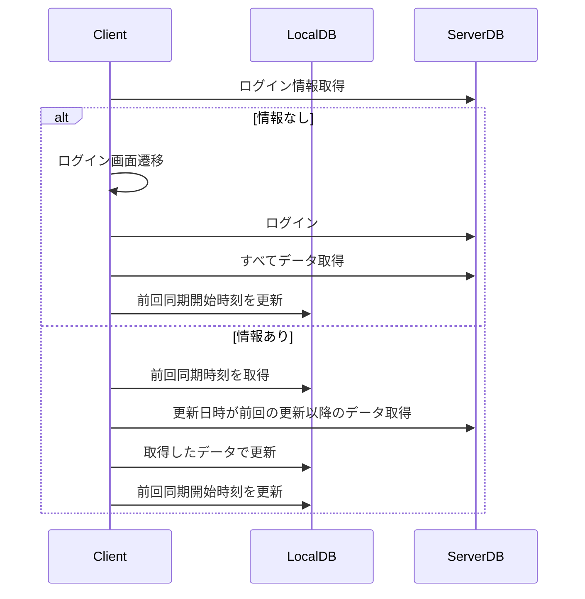
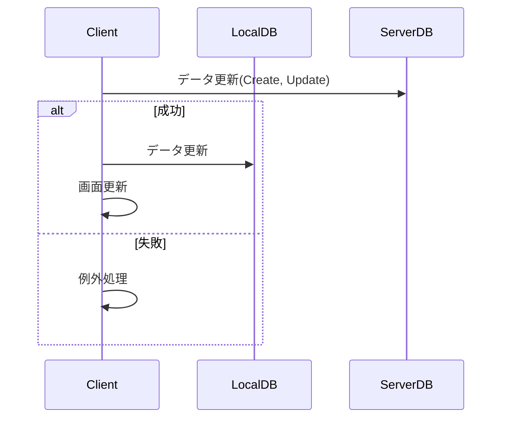
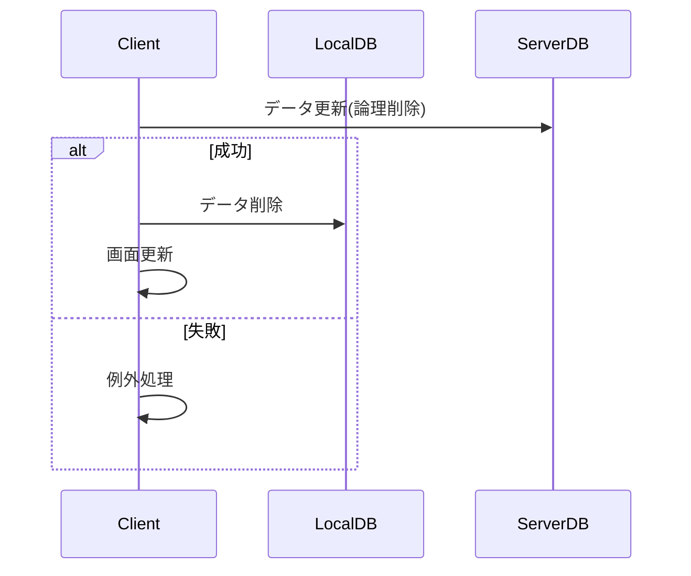
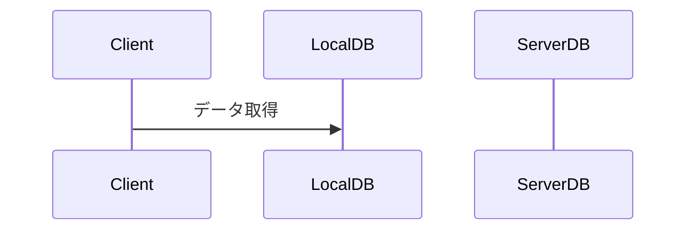

# クライアントとサーバ間のデータ同期フロー

## 目的
* 全文検索
* アプリ起動高速化: 同期はバックグラウンドで行う

## 設計
* 全体同期は起動時のみ

## 起動時同期シーケンス

```mermaid
sequenceDiagram
  participant 1 as Client
  participant 2 as LocalDB
  participant 3 as ServerDB

  1->>3: ログイン情報取得
  alt 情報なし
    1->>1: ログイン画面遷移
    1->>3: ログイン
    1->>3: すべてデータ取得
    1->>2: 前回同期開始時刻を更新
  else 情報あり
    1->>2: 前回同期時刻を取得
    1->>3: 更新日時が前回の更新以降のデータ取得
    1->>2: 取得したデータで更新
    1->>2: 前回同期開始時刻を更新
  end
```

## データ更新シーケンス

```mermaid
sequenceDiagram
  participant 1 as Client
  participant 2 as LocalDB
  participant 3 as ServerDB

  1->>3: データ更新(Create, Update)
  alt 成功
    1->>2: データ更新
    1->>1: 画面更新
  else 失敗
    1->>1: 例外処理
  end
```

## データ削除シーケンス

```mermaid
sequenceDiagram
  participant 1 as Client
  participant 2 as LocalDB
  participant 3 as ServerDB

  1->>3: データ更新(論理削除)
  alt 成功
    1->>2: データ削除
    1->>1: 画面更新
  else 失敗
    1->>1: 例外処理
  end
```

## データ取得シーケンス

```mermaid
sequenceDiagram
  participant 1 as Client
  participant 2 as LocalDB
  participant 3 as ServerDB

  1->>2: データ取得
```