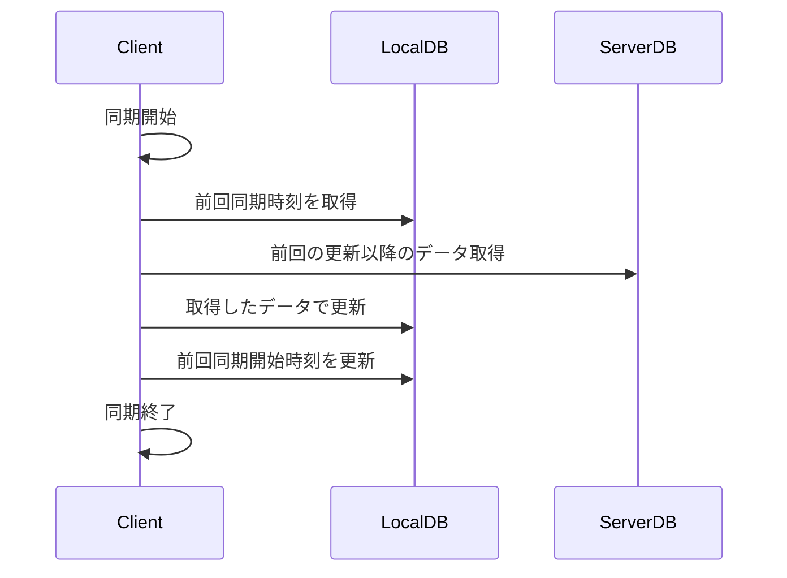
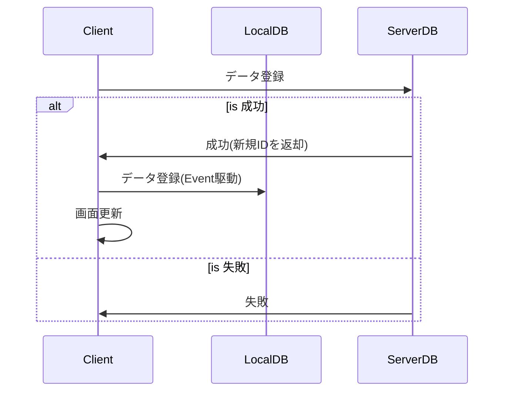

# クライアントとサーバ間のデータ同期フロー

## 目的
* 全文検索
* アプリ起動高速化: 同期はバックグラウンドで行う

## 設計
* CQRS方式に変更
  * QueryとCommandに分ける
  * Readを完全にQueryのみにはしない
    * 更新時にサーバから取得するケースがあるため
  * LocalDBへの反映は(Event→Queue)
  * Deleteは論理削除
* 全体同期は起動時のみ

## 起動時同期シーケンス

## データ更新時シーケンス

